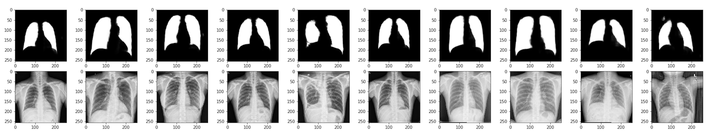

# Lung-Segmentation
Lung segmentation on chest x-rays using UNet, UNet-ResNet architectures written in both Keras and PyTorch.

Training is done on AWS Sagemaker. The data is divided randomly into train and validation sets and was stored in S3. 

Dataset Used:

http://openi.nlm.nih.gov/imgs/collections/NLM-MontgomeryCXRSet.zip from website https://lhncbc.nlm.nih.gov/publication/pub9931

Data Channels in Sagemaker

<b>SM_CHANNEL_TRAIN</b>: For training data set, the path is `/opt/ml/input/data/train`

<b>SM_CHANNEL_EVAL</b>: For validation data set, the path is `/opt/ml/input/data/eval`

## Inferencing Results on a small data set:

